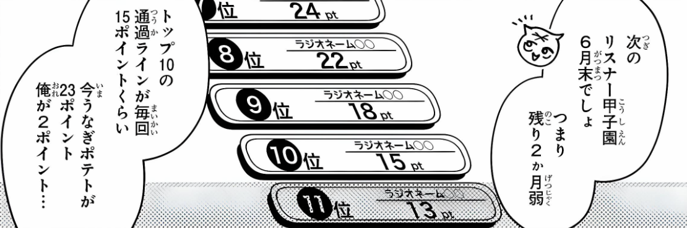
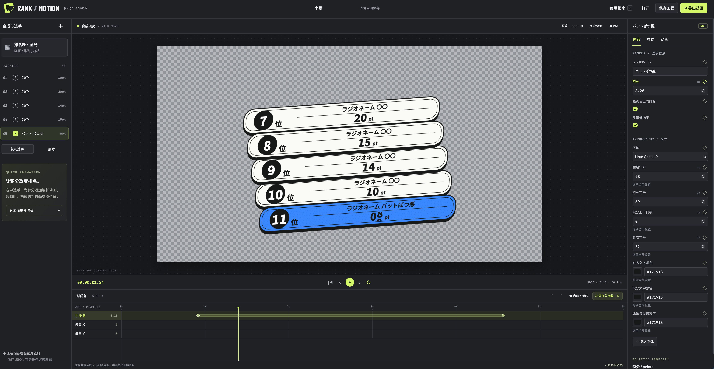
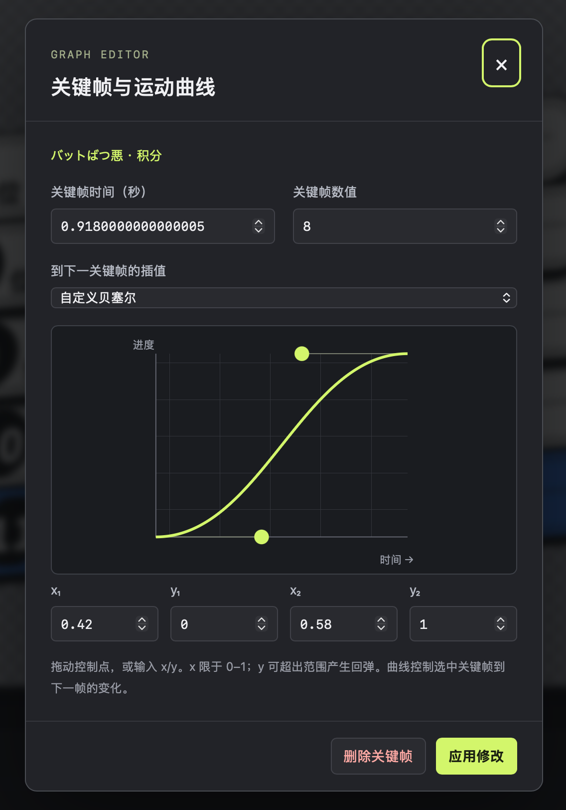

# RANK / MOTION

[中文](#中文) · [English](#english) · [日本語](#日本語)

## 中文

一个以 p5.js 渲染的漫画排名动画编辑器。视觉设计参考原作漫画《someone hertz》中出现的排名 UI，包括双描边胶囊姓名框、黑色名次章、错列、倾斜和厚阴影。

### 项目背景

本动画项目为 [Niconico 视频项目 lv351456470](https://live.nicovideo.jp/watch/lv351456470?rf=nvpc&rp=tag) 制作，旨在探索 AI 参与视频制作的边界。项目以真实还原原作漫画《someone hertz》中出现的排名 UI 为目标，并将静态画面转化为可编辑、可设置关键帧、可录制与导出的动态动画系统。



*原作漫画中排名 UI 的参考效果。*

### 界面展示

完整工作区将排名者列表、合成预览、属性检查器和关键帧时间线整合在同一界面中。



关键帧曲线编辑器可精确修改关键帧时间、数值、插值方式和自定义贝塞尔控制点。



### 下载与快速启动

1. 打开 [GitHub Releases](https://github.com/takinoboru/rank-motion-studio/releases/latest)，下载 `rank-motion-studio-v1.0.0.zip`；可用同页的 `.sha256` 文件校验下载内容。
2. 完整解压 ZIP，不要直接运行压缩包内的文件。
3. macOS 双击 `start-macos.command`，Windows 双击 `start-windows.bat`，Linux 运行 `./start-linux.sh`。
4. 启动器会在 http://127.0.0.1:8765/ 打开编辑器。保持终端窗口运行，按 Control+C 可停止服务。

发布包不需要安装 npm 或第三方依赖。启动器优先使用 Python 3 标准库创建本地服务器；如果没有 Python 3，会直接打开 `index.html`。直接打开仍可编辑，但为了稳定使用 WebCodecs 视频导出，建议通过本地服务器启动。工程保存在当前浏览器中，请定期使用“保存工程”导出 JSON 备份。

### 从源码配置

```sh
git clone https://github.com/takinoboru/rank-motion-studio.git
cd rank-motion-studio
python3 scripts/serve.py --directory dist --open
```

安装了 Node.js 与 npm 的开发者也可以运行 `npm start`。执行 `python3 scripts/build_release.py` 或 `npm run package` 可在 `release/` 中重新生成版本 ZIP 与 SHA-256 校验文件；打包过程只使用 Python 3 标准库。

### 使用

网页内的“使用指南”介绍全部操作。

- 左侧可编辑 1–30 位排名者；姓名、积分、单人样式、字体与全局参数均可修改。
- 全局排列可调整位置、倾斜、旋转、错列和行距；姓名框可调整圆角、双描边、填充、阴影和点阵。
- 每位排名者可分别设置姓名色、积分色、名次文字色、字号、入场方式、延迟、透明度、位置和缩放等。
- 选中属性后按 K 或点击 ◇ 添加关键帧；拖动菱形可修改时间，双击可编辑值与贝塞尔曲线。文字与开关采用保持插值。
- 分数关键帧会触发自动排名交换和积分逐位滚动；平分时按排名者列表顺序。隐藏的排名者仍参与排名。
- 自动换位的时间检测精度为 1/240 秒，交换时长与曲线可在全局动画中设置；播放和拖动使用同一套确定性计算。
- 默认动画在 2–6 秒使“うなぎポテト”从 13 pt 增至 26 pt。
- 支持本机自动保存、JSON 导入/导出及撤销重做。字体文件只保留在当前页面，换设备或刷新后需重新载入；JSON 不含字体。
- 姓名及积分太长时会自动缩小，以避免溢出姓名框。位置单位基于 1920×1080 设计空间。

### 导出

- 分辨率最高为 3840×2160，另有竖屏 2160×3840 与方形规格。支持 24 / 25 / 30 / 50 / 60 fps。
- WebM 逐帧输出使用 WebCodecs VP9 或 VP8，并通过 `isConfigSupported` 检查当前设备；时间戳按所选帧率生成。渲染速度与实时预览帧率无关。
- 实时 WebM 录制使用 MediaRecorder，实际帧率受性能与浏览器调度影响。
- PNG 序列支持透明背景。默认将全部 PNG 打包为一个 ZIP，包内附带帧率说明；也可选择每 60 帧或约 96 MB 分包。分包时请允许浏览器下载多个文件。
- PNG 当前帧按合成分辨率输出。合成时长最高 120 秒，可选择局部输出。
- 视频保存在浏览器内存中，长片可分段输出。4K60 视频取决于设备编码能力；不支持时可选择 PNG 序列或较低规格。
- 竖屏和方形合成默认完整容纳 16:9 设计空间，可通过全局缩放、位置和排列重新构图。

### 文件

- `dist/engine.js`：插值、积分、排名交换以及 p5/Canvas2D 绘图核心。
- `dist/app.js`：中文编辑界面、关键帧、贝塞尔控制、工程管理与导出。
- `dist/vendor/`：本地固定版本 p5.js 1.11.11、webm-muxer 5.1.4、fflate 0.8.2。内置 Noto Sans JP 与 Barlow Condensed 开源字体，无需在线字体服务。

### 验证范围

已验证积分插值、并列与降分、四次换位、交换连续性、确定性跳转、颜色与保持插值、全局继承、4K 原生画布渲染、透明像素、长姓名与最大积分、工程校验与关键帧合并。另以模拟编码器验证 4K60 的帧数、时间戳、时长、资源关闭及取消路径。

尚未执行浏览器交互测试或实际硬件视频编码测试。WebMCP 会在支持的页面中注册工程读取与积分动画创建工具；当前环境没有支持的 WebMCP 验证上下文，因此尚未验证工具注册。

## English

RANK / MOTION is a p5.js-based editor for animated manga-style rankings. Its visual language follows the ranking UI shown in the original manga *someone hertz*, including double-outlined capsule nameplates, black rank badges, staggered rows, slanted composition, and heavy shadows.

### Project background

This animation project was created for the [Niconico video project lv351456470](https://live.nicovideo.jp/watch/lv351456470?rf=nvpc&rp=tag) to explore the boundaries of AI participation in video production. It aims to faithfully recreate the ranking UI from the original manga *someone hertz* and turn the static design into an editable animation system with keyframes, recording, and export tools.


*Reference appearance of the ranking UI in the original manga.*

### Interface preview

The complete workspace brings the ranker list, composition preview, property inspector, and keyframe timeline into one interface.


The keyframe graph editor provides precise control over keyframe timing, values, interpolation modes, and custom Bézier control points.


### Download and quick start

1. Open [GitHub Releases](https://github.com/takinoboru/rank-motion-studio/releases/latest) and download `rank-motion-studio-v1.0.0.zip`. The accompanying `.sha256` file can be used to verify the download.
2. Extract the entire ZIP instead of running files inside the archive.
3. Double-click `start-macos.command` on macOS, double-click `start-windows.bat` on Windows, or run `./start-linux.sh` on Linux.
4. The launcher opens the editor at http://127.0.0.1:8765/. Keep the terminal window open and press Control+C to stop the server.

The release package requires no npm installation or third-party dependencies. Its launcher uses the Python 3 standard library when available and otherwise opens `index.html` directly. Direct opening supports editing, but the local server is recommended for reliable WebCodecs video export. Projects are stored in the current browser, so export JSON backups regularly with “Save Project.”

### Configure from source

```sh
git clone https://github.com/takinoboru/rank-motion-studio.git
cd rank-motion-studio
python3 scripts/serve.py --directory dist --open
```

Developers with Node.js and npm may use `npm start`. Run `python3 scripts/build_release.py` or `npm run package` to recreate the release ZIP and SHA-256 checksum in `release/`. Packaging uses only the Python 3 standard library.

### Usage

The in-app guide explains all controls.

- Edit 1–30 rankers, including their names, points, individual styles, fonts, and global settings.
- Adjust the overall position, slant, rotation, staggering, and row spacing. Nameplates support editable corner radius, double outlines, fill, shadow, and halftone texture.
- Customize each ranker's name color, point color, rank text color, font sizes, entrance animation, delay, opacity, position, scale, and more.
- Select a property and press K or click ◇ to add a keyframe. Drag diamonds to change timing, and double-click them to edit values and Bézier curves. Text and toggle values use hold interpolation.
- Score keyframes trigger automatic rank swaps and slot-machine-style digit rolls. Ties follow the ranker list order, and hidden rankers still participate in ranking.
- Automatic swaps are detected at 1/240-second precision. Swap duration and easing can be changed in the global animation settings. Playback and timeline scrubbing use the same deterministic calculation.
- The default animation raises “うなぎポテト” from 13 pt to 26 pt between 2 and 6 seconds.
- Local autosave, JSON import/export, undo, and redo are included. Loaded font files remain only in the current page and must be loaded again after a refresh or on another device; fonts are not embedded in JSON files.
- Long names and point values shrink automatically to stay inside the nameplate. Position values use a 1920×1080 design space.

### Export

- Output up to 3840×2160, with additional 2160×3840 portrait and square presets. Supported frame rates: 24 / 25 / 30 / 50 / 60 fps.
- Frame-accurate WebM export uses WebCodecs VP9 or VP8 and checks the device with `isConfigSupported`. Timestamps follow the selected frame rate, independently of preview performance.
- Real-time WebM recording uses MediaRecorder, so the effective frame rate depends on hardware performance and browser scheduling.
- PNG sequences support transparent backgrounds. By default, all PNG frames are stored in one ZIP with frame-rate information; optional splitting is available every 60 frames or at approximately 96 MB.
- Current-frame PNG export uses the selected composition resolution. Compositions can be up to 120 seconds long and may be exported as a selected range.
- Video data is held in browser memory, so long animations can be exported in sections. 4K60 depends on the device's encoder; use a PNG sequence or lower settings when hardware encoding is unavailable.
- Portrait and square compositions fit the full 16:9 design space by default. Global scale, position, and layout controls can be used to reframe the scene.

### Files

- `dist/engine.js`: interpolation, scoring, rank swaps, and the p5/Canvas2D rendering core.
- `dist/app.js`: Chinese editing interface, keyframes, Bézier controls, project management, and export.
- `dist/vendor/`: pinned local copies of p5.js 1.11.11, webm-muxer 5.1.4, and fflate 0.8.2. Open-source Noto Sans JP and Barlow Condensed fonts are bundled, so no online font service is required.

### Validation scope

The project has been checked for score interpolation, ties and score decreases, four consecutive rank swaps, swap continuity, deterministic seeking, color and hold interpolation, global inheritance, native 4K canvas rendering, transparent pixels, long names, maximum point values, project validation, and keyframe merging. A simulated encoder also verifies 4K60 frame count, timestamps, duration, resource cleanup, and cancellation paths.

Browser interaction and real hardware video encoding have not yet been tested. WebMCP registers project-reading and score-animation tools on supported pages; tool registration has not been verified because the current environment does not provide a compatible WebMCP validation context.

## 日本語

RANK / MOTION は、p5.js で描画する漫画風ランキングアニメーションエディターです。二重線のカプセル型ネームプレート、黒い順位バッジ、段違いの配置、傾き、太い影など、原作漫画『someone hertz』に登場するランキング UI の表現を参考にしています。

### プロジェクトの背景

本アニメーションプロジェクトは、[ニコニコ生放送の動画企画 lv351456470](https://live.nicovideo.jp/watch/lv351456470?rf=nvpc&rp=tag) のために制作されました。AI が映像制作に参加する可能性とその境界を探ることを目的としています。原作漫画『someone hertz』に登場するランキング UI を忠実に再現し、静止画のデザインを、編集・キーフレーム設定・録画・書き出しが可能なアニメーションシステムへ発展させることを目指しています。


*原作漫画に登場するランキング UI の参考イメージ。*

### 画面紹介

ランカー一覧、コンポジションプレビュー、プロパティインスペクター、キーフレームタイムラインを 1 つのワークスペースにまとめています。


キーフレーム曲線エディターでは、キーフレームの時間、値、補間方法、カスタムベジェ制御点を正確に調整できます。


### ダウンロードとクイックスタート

1. [GitHub Releases](https://github.com/takinoboru/rank-motion-studio/releases/latest) を開き、`rank-motion-studio-v1.0.0.zip` をダウンロードします。同じページの `.sha256` ファイルでダウンロード内容を検証できます。
2. ZIP 内のファイルを直接実行せず、ZIP 全体を展開してください。
3. macOS では `start-macos.command`、Windows では `start-windows.bat` をダブルクリックします。Linux では `./start-linux.sh` を実行します。
4. ランチャーが http://127.0.0.1:8765/ でエディターを開きます。ターミナルを起動したままにし、終了するには Control+C を押します。

配布パッケージでは npm や外部依存パッケージのインストールは不要です。ランチャーは利用可能な場合に Python 3 標準ライブラリでローカルサーバーを起動し、Python 3 がない場合は `index.html` を直接開きます。直接開いた場合も編集できますが、WebCodecs による動画書き出しを安定させるにはローカルサーバーの利用を推奨します。プロジェクトは現在のブラウザーに保存されるため、「プロジェクトを保存」から JSON のバックアップを定期的に書き出してください。

### ソースからのセットアップ

```sh
git clone https://github.com/takinoboru/rank-motion-studio.git
cd rank-motion-studio
python3 scripts/serve.py --directory dist --open
```

Node.js と npm がある場合は `npm start` も使用できます。`python3 scripts/build_release.py` または `npm run package` を実行すると、`release/` に配布用 ZIP と SHA-256 チェックサムを再生成できます。パッケージ作成には Python 3 標準ライブラリだけを使用します。

### 使い方

すべての操作はアプリ内の使用ガイドで確認できます。

- 1～30 位のランカーを編集できます。名前、ポイント、個別スタイル、フォント、全体設定を変更できます。
- 全体の位置、傾斜、回転、段違い、行間を調整できます。ネームプレートでは角丸、二重線、塗り、影、網点を変更できます。
- 各ランカーの名前色、ポイント色、順位文字色、文字サイズ、登場アニメーション、遅延、不透明度、位置、拡大率などを個別に設定できます。
- プロパティを選択して K キーを押すか ◇ をクリックするとキーフレームを追加できます。菱形をドラッグすると時間を変更でき、ダブルクリックすると値とベジェ曲線を編集できます。テキストとスイッチはホールド補間を使用します。
- ポイントのキーフレームに応じて順位が自動で入れ替わり、数字はスロットのように回転します。同点の場合はランカー一覧の順序に従い、非表示のランカーも順位計算に含まれます。
- 自動入れ替えは 1/240 秒の精度で検出されます。入れ替え時間とイージングは全体アニメーション設定で変更できます。再生とタイムライン操作には同じ決定的な計算を使用します。
- 初期アニメーションでは、2～6 秒の間に「うなぎポテト」が 13 pt から 26 pt へ上昇します。
- ローカル自動保存、JSON の読み込みと書き出し、元に戻す、やり直しに対応しています。読み込んだフォントファイルは現在のページ内だけに保持されるため、再読み込み後や別の端末では再度読み込む必要があります。JSON にはフォントを含みません。
- 名前やポイントが長い場合は、ネームプレートからはみ出さないように自動で縮小されます。位置の値は 1920×1080 のデザイン空間を基準にしています。

### 書き出し

- 最大 3840×2160 に対応し、2160×3840 の縦長と正方形のプリセットも利用できます。24 / 25 / 30 / 50 / 60 fps に対応します。
- フレーム単位の WebM 書き出しには WebCodecs の VP9 または VP8 を使用し、`isConfigSupported` で端末の対応状況を確認します。タイムスタンプは選択したフレームレートから生成され、プレビュー性能には左右されません。
- リアルタイム WebM 録画には MediaRecorder を使用するため、実際のフレームレートは端末性能とブラウザーのスケジューリングに左右されます。
- PNG シーケンスは透過背景に対応します。初期設定では、すべての PNG をフレームレート情報とともに 1 つの ZIP に保存します。60 フレームごと、または約 96 MB ごとに分割することもできます。
- 現在フレームの PNG は選択したコンポジション解像度で書き出されます。コンポジションは最大 120 秒で、範囲を指定して書き出せます。
- 動画データはブラウザーのメモリに保持されるため、長いアニメーションは分割して書き出せます。4K60 は端末のエンコーダー性能に依存します。対応していない場合は PNG シーケンスまたは低い設定を使用してください。
- 縦長と正方形のコンポジションでは、初期状態で 16:9 のデザイン空間全体が収まります。全体の拡大率、位置、配置を使って再構成できます。

### ファイル

- `dist/engine.js`：補間、ポイント、順位入れ替え、p5/Canvas2D 描画のコア。
- `dist/app.js`：中国語の編集画面、キーフレーム、ベジェ制御、プロジェクト管理、書き出し。
- `dist/vendor/`：p5.js 1.11.11、webm-muxer 5.1.4、fflate 0.8.2 の固定ローカル版。オープンソースフォントの Noto Sans JP と Barlow Condensed を同梱しており、オンラインフォントサービスは不要です。

### 検証範囲

ポイント補間、同点とポイント減少、4 回連続の順位入れ替え、入れ替えの連続性、決定的なシーク、色とホールド補間、全体設定の継承、4K ネイティブキャンバス描画、透過ピクセル、長い名前、最大ポイント値、プロジェクト検証、キーフレームの統合を確認済みです。模擬エンコーダーにより、4K60 のフレーム数、タイムスタンプ、時間、リソース解放、キャンセル処理も検証しています。

ブラウザー操作テストと実機での動画エンコードテストはまだ実施していません。WebMCP は対応ページでプロジェクト読み取りとポイントアニメーション作成ツールを登録しますが、現在の環境には対応する WebMCP 検証コンテキストがないため、ツール登録は未検証です。

## Dependencies and licenses / 依赖与许可 / 依存関係とライセンス

- p5.js: https://p5js.org/ — LGPL-2.1
- webm-muxer: https://github.com/Vanilagy/webm-muxer — MIT
- fflate: https://github.com/101arrowz/fflate — MIT
- Noto Sans JP and Barlow Condensed: https://fonts.google.com/ — SIL OFL 1.1

Font fallback and WebCodecs support may vary by operating system and browser. / 字体回退与 WebCodecs 支持可能因操作系统和浏览器不同而变化。/ フォントのフォールバックと WebCodecs の対応状況は、OS やブラウザーによって異なる場合があります。
